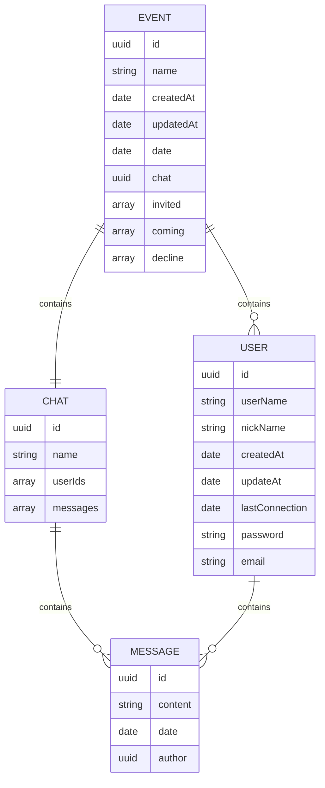

# goatee

## Client

Run with `npm run serve` in client folder.

## API

Run with `cargo run` in api folder.

## Docker

Run with `docker-compose up -d` in root folder.

## Database struct

```mermaid
erDiagram
    USER {
        uuid id
        string userName
        string nickName
        date createdAt
        date updateAt
        date lastConnection
        string password
        string email
    }
    CHAT {
        uuid id
        string name
        array userIds
        array messages
    }
    CHAT ||--o{ MESSAGE : contains
    USER ||--o{ MESSAGE : contains
    EVENT ||--o{ USER : contains
    EVENT ||--|| CHAT : contains
    MESSAGE {
        uuid id
        string content
        date date
        uuid author
    }
    EVENT {
        uuid id
        string name
        date createdAt
        date updatedAt
        date date
        uuid chat
        array invited
        array coming
        array decline
    }
```
